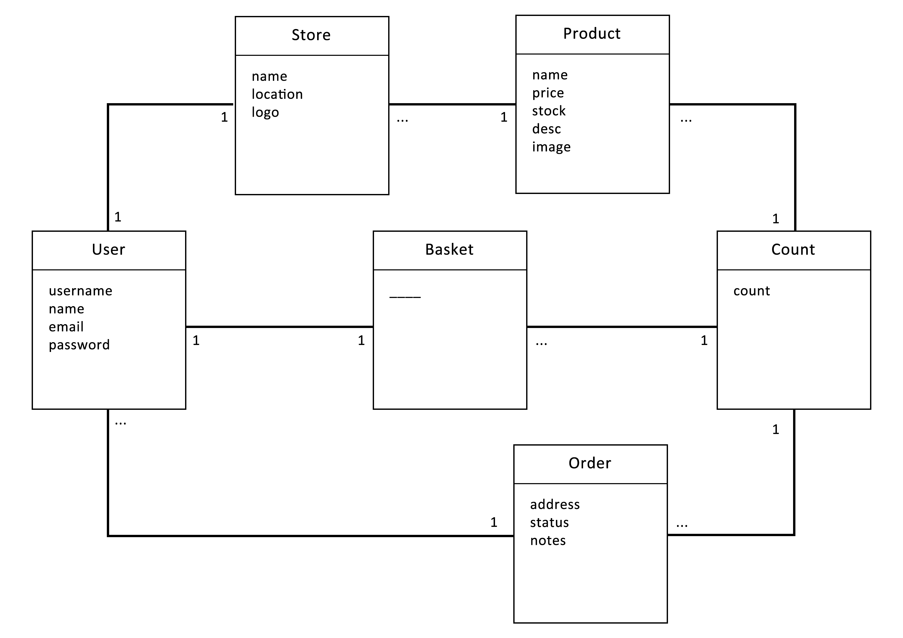

# Online Shopping Web App

"Agents On Cloud" *Technical Assessment* for *React Developer* postion

Develop an online shopping web application using react & node JS, your app should give the user ability to sign up as a seller or a shopper.

## Sellers can do the following

- Create an online store.
- Add/remove items to their store.
- View store orders & revenues.

## Shoppers can do the following

- View stores.
- Add/remove items to cart.
- Make order for selected items.
- View previous orders.

## Execution

*I'm aware that the task isn't finished. Anyway, here's what I came to with the time I dedicated to fullfill the assignment. Looking forward to hear from you soon.*

You may check both FE & BE built in seperate directories

[Frontend](./client/README.md)

[Backend](./server/README.md)

